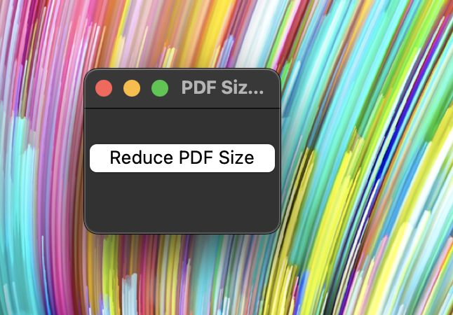

```markdown
# PDF FIT - PDF Size Reducer



PDF FIT is a user-friendly Python-based tool designed to compress PDF files efficiently, making them optimal for sharing on various platforms where file size matters, such as LinkedIn or other online platforms. This tool automates the process of reducing PDF sizes, ensuring they are optimized for online use.


## Features

- **Simple Interface:** A straightforward UI allows users to reduce PDF sizes with ease.
- **Cross-platform:** Works on Windows, macOS, Linux, and more.
- **Efficient Compression:** Compresses PDF files while maintaining quality.

## Installation and Usage

### Prerequisites

Ensure you have Python installed on your system. If not, download and install Python from [Python's official website](https://www.python.org/downloads/).

### Installation Steps

1. **Clone the Repository:**

   ```bash
   git clone https://github.com/kvnbbg/pdf_fit.git
   cd pdf_fit
   ```

2. **Install Dependencies:**

   Install the required libraries using pip:

   ```bash
   pip install PyPDF2
   ```

3. **Run the Application:**

   Run the script to execute the PDF size reduction tool:

   ```bash
   python pdf_size_reduce.py
   ```

4. **Follow On-Screen Instructions:**

   - Click the "Reduce PDF Size" button.
   - Select the PDF file to compress.
   - Choose the location to save the reduced PDF.

### Creating Standalone Executable (macOS, Windows, Linux)

To create an executable app for your specific platform, follow these steps:

1. **Create a Python script named `pdf_size_reduce.py` containing the code for the PDF size reduction tool.

2. **Create a `setup.py` file with setup configurations for your platform-specific executable.

3. **Run the setup file to create the executable:

   For macOS (using `py2app`):

   ```bash
   python setup.py py2app
   ```

   For Windows (using `py2exe`) or Linux (using `PyInstaller`), adjust the setup file and use the corresponding command to create the executable.

4. **Find the Generated App:**

   Navigate to the `dist` folder and find the generated app or executable.

## Credits

This PDF size reduction tool is developed by [Kevin Marville](https://github.com/kvnbbg) and is distributed under the [MIT License](LICENSE).

### pdf_size_reduce.py

```python
# The content of pdf_size_reduce.py script goes here
```

### setup.py

```python
# The content of setup.py script goes here
```

### install.py

```python
# The content of install.py script goes here
```

For further details, explore the scripts provided in this repository.

```

Replace `[Kevin Marville](https://github.com/kvnbbg)` with your actual name and GitHub profile link. Additionally, ensure the sections about `pdf_size_reduce.py`, `setup.py`, and `install.py` contain the respective script content.